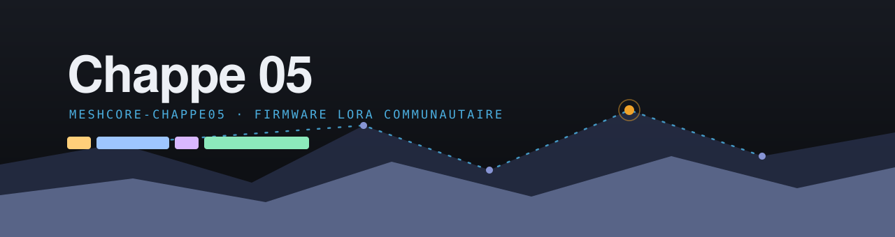

[English](README.md) · **Français**

 

**Fork du firmware MeshCore pour le réseau LoRa communautaire Chappe 05 (Hautes-Alpes) : filtrage par type de paquet, qualité de service et observabilité des relais.**

---

> **Bêta.** Le réseau est en construction et les réglages par classe ne sont pas encore éprouvés sur le terrain. Les commandes, les valeurs par défaut et les images peuvent changer d'une version à l'autre.

## Le projet

Chappe 05 est un réseau LoRa communautaire en construction autour de Gap, dans les Hautes-Alpes, du nom du télégraphe optique de Claude Chappe : une chaîne de tours sur les points hauts, chacune visible de la suivante, relayant un message de proche en proche. C'est la topologie du réseau, deux siècles plus tard, sur la bande 868 MHz.

Ce dépôt suit MeshCore en amont et y ajoute une couche de préservation du réseau, pensée pour un maillage partagé où un seul relais mal réglé peut gêner tout le monde. L'objectif est de faire remonter ces fonctions dans le firmware officiel, pas de maintenir un fork parallèle.

## Ce que ce fork ajoute

| Fonction | Commande | Rôle |
|---|---|---|
| Plafonds de sauts par type | `set flood.max.type <type> <sauts>` | limiter la portée d'un type de paquet sans toucher aux autres |
| Priorité par type | `set prio.type <type> <malus>` | faire céder le passage à un type quand la file est chargée |
| Budget de temps d'antenne par type | `set airtime.budget.type <type> <pourcent>` | plafonner la part d'airtime d'un type, en pourcentage du budget de rapport cyclique |
| Données de canal en inondation | `set grp.data.block`, `set grp.data.allow` | refuser les GRP_DATA inondés, rouvrir au cas par cas |
| Observabilité du filtrage | `stats-filter` | compter les paquets écartés, par motif |
| Preset radio épinglé | `LORA_CR=8` | aligner une installation neuve sur le preset réseau 869,618 MHz, 62,5 kHz, SF8, CR8 |

Le socle de blocage par voisin (`block.add` et suivantes) et la confirmation passive de relais sont l'œuvre de Fabrice Crohas ; la couche de filtrage par type, la QoS et les compteurs ont été ajoutés par Chappe 05.

## Outils en ligne

Tout se fait depuis le navigateur, sans rien installer, en WebSerial.

| Outil | Adresse | Rôle |
|---|---|---|
| Flasheur | [chappe05.fr/flasher](https://chappe05.fr/flasher/) | installer le firmware et configurer un relais par catégories |
| Banc d'essai | [chappe05.fr/banc](https://chappe05.fr/banc/) | forger, émettre et observer des paquets, mesurer le filtrage |
| Politique des relais | [chappe05.fr/politique-relais](https://chappe05.fr/politique-relais/) | classes de relais, régions, réglages recommandés |

## Démarrer

Le plus simple est de passer par le [flasheur en ligne](https://chappe05.fr/flasher/) : il installe une image pré-compilée et configure la carte.

Pour compiler soi-même, ce dépôt reste un projet [PlatformIO](https://platformio.org/) comme MeshCore en amont. La documentation complète de la bibliothèque, la liste des cartes et les instructions de compilation sont maintenues côté amont : voir [meshcore-dev/MeshCore](https://github.com/meshcore-dev/MeshCore). Les images sont aussi produites par les workflows de l'onglet [Actions](https://github.com/und3rX1337/meshcore-chappe05/actions).

## Contribuer

Un bug, une observation : ouvrez une [issue](https://github.com/und3rX1337/meshcore-chappe05/issues/new). Une correction, une amélioration : ouvrez une pull request. Les remarques d'opérateurs sont les bienvenues, c'est le terrain qui fait évoluer les réglages.

## Amont et crédits

Basé sur [MeshCore](https://github.com/meshcore-dev/MeshCore) de Scott Powell (`meshcore-dev`), bibliothèque C++ légère de routage multi-sauts pour LoRa. Le code amont conserve sa licence et ses auteurs d'origine.
